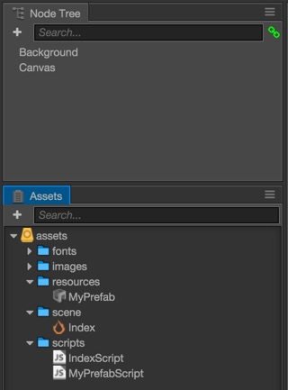
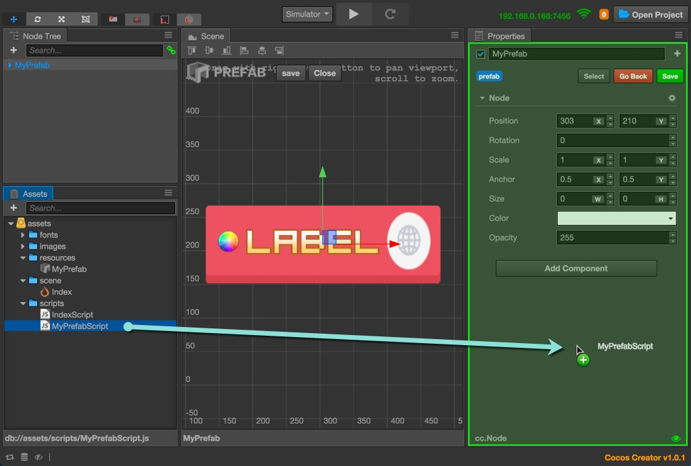
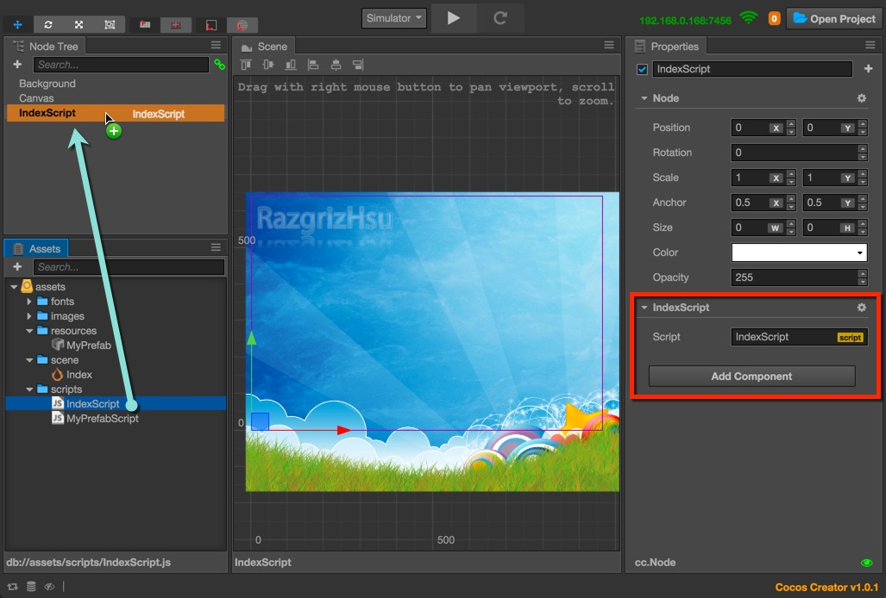
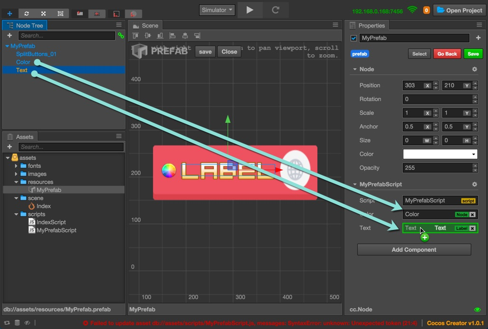
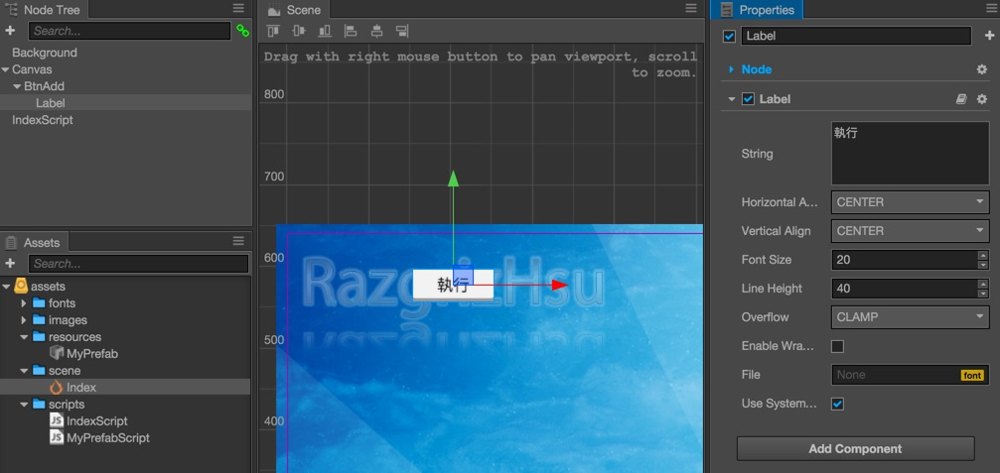
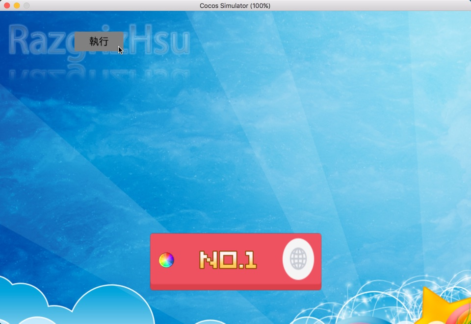
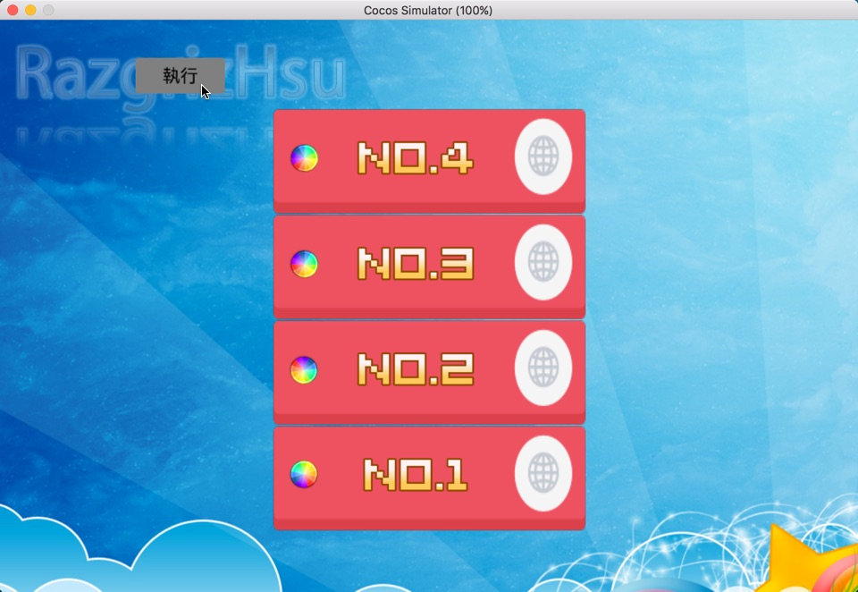

## 基礎Prefab教程 - 2 - 用代碼進行控制

此處的專案依然會放在 [我的GitHub中](https://github.com/RazgrizHsu/CocosCreatorExamples/tree/master/Prefab/) 想直接拿的童鞋請自取，
這次是由上次的 基礎教程1 沿用而來，我們將剛剛的專案再打開繼續做就可以了

------

#### 預先準備

打開專案後，
我們先將上次製作的 **MyPrefab** 從場景中刪除，
因為這次將直接從資源管理器中進行編輯，

先讓我們在資源管理器中，新增一個 scripts 資料夾，
這邊我們要新增兩個 Script 檔，
一個做給場景用，命名為 **IndexScript** ，
再新增一個給Prefab用，命為 **MyPrefabScript** 

所以現在我們的場景跟資源管理器看起來應該像這樣..

------

#### 將腳本關聯至Prefab上

再來我們先雙擊我們的Prefab，進入編輯模式，
接著、將剛剛的MyPrefabScript，拖曳至MyPrefab的屬性裡，做為默認腳本

記得做完這個步驟，要按下上面的Save，將這個修改存檔。

#### 將腳本關聯至Scene上

這個步驟就跟上面差不多，唯一不同的是，
場景的腳本我習慣放在外面，所以我會建立一個空Node來單獨放腳本，如下圖..

------

## 接著，開始寫腳本吧

#### 首先是 MyPrefab 的部份
我們先打開 MyPrefabScript，將代碼改為如下..

	cc.Class(
	{
	    extends: cc.Component,
	    properties: 
	    {
	        Color: cc.Node,
	        Text: { default: null, type: cc.Label }
	    },
	    
	    setNumberBy: function( number )
	    {
	        //這邊直接將我們的Label字串設定為 No.#
	        this.Text.string = ( 'No.' + number );
	    },
	    
	    Run: function()
	    {
	        //這邊建立一個永遠不停止的repeat，動作是每1秒轉360度
	        var action = cc.repeatForever( cc.rotateBy( 1, 360 ) );
	        //讓我們的彩球旋轉吧!
	        this.Color.node.runAction( action );
	    }
	});

將上面的腳本儲存後，

接著，我們要進行屬性的關聯，
雙擊資源管理器中的 MyPrefab，我們應該可以看到腳本的部份改變了，
多出了兩個空的框框，
因為我們在 properties 中，新增了一個 Color及Text，
所以我們要分別把 Color 及 Text 拖曳至腳本的屬性框中，使其關聯，如下圖..

關聯完畢後，按下儲存，
至此，我們Prefab的部份就準備完畢了。

------

#### 接著是場景(Scene)的部份

我們先回到 Index.fire 場景，
先讓我們在 Canvas 下，建立一個 Button ，並且將其命名為 **BtnAdd** ，
我順便將內文改為 執行 ，這樣比較好識別，建立好後如下圖..

好了，接下來就是看代碼說故事的時間了，
將你的 IndexScript 打開，把下面的代碼貼上去

	cc.Class(
	{
	    extends: cc.Component,
	    properties: 
	    {
	        ClickCount: 0,
	        //除了計數器外，這邊我故意留空，我準備全部使用代碼來控制
	    },

	    onLoad: function ()
	    {
	        //首先，我們先找到我們剛剛新增的按鈕
	        var NodeBtnAdd = cc.find( 'Canvas/BtnAdd' ); //cc.find回傳的是Node
	        
	        //然後，記得養成時時檢查變數是否存在、並且寫Log的習慣，
	        //上面的參數如果打錯，這邊就會印出Log，並且也不會再往下執行
	        if( !NodeBtnAdd ) { cc.log('找不到Button, 請確認find的參數正確'); return; }
	        
	        //接著，我們將監聽按鈕的點擊事件，關聯至下方的onBtnAddClicked方法
	        NodeBtnAdd.on( cc.Node.EventType.TOUCH_END, this.onBtnAddClicked.bind( this ) );
	    },

	    //由於我們打算動態新增Prefab來進行使用，所以我們在這個點擊事件中進行載入
	    onBtnAddClicked: function()
	    {
	        //我們先動態取得Canvas
	        var CanvasNode = cc.find( 'Canvas' );
	        if( !CanvasNode ) { cc.log( '找不到Canvas畫布，請確認你的場景裡有Canvas' ); return; } 
	        
	        //這邊先將 this 指標存到另一個變數, 在別的方法裡this是會被改變的
	        var root = this; 
	        
	        //Prefab的路徑
	        //不過因為我們的MyPrefab直接就放在 /assets/resources/ 下，就直接寫
	        var prefabPath = 'MyPrefab';
	        //Ps. 假設你是放在在resources下的prefabs資料夾中，你就得寫 'prefabs/MyPrefab'
	        
	        
	        //這邊我們新增一個私有方法，來做為載入Prefab時的方法
	        //(當然你也可以直接寫在loadRes參數上，我只是覺得這樣比較容易看清楚)
	        var onResourceLoaded = function( errorMessage, loadedResource )
	        {
	            //一樣，養成檢查的好習慣
	            if( errorMessage ) { cc.log( '載入Prefab失敗, 原因:' + errorMessage ); return; }
	            if( !( loadedResource instanceof cc.Prefab ) ) { cc.log( '你載入的不是Prefab, 你做了什麼事?' ); return; } //這個是型別的檢查
	            
	            //我們將root裡的計數器加1
	            root.ClickCount++;
	            
	            //接著，我們就可以進行實例化了
	            var newMyPrefab = cc.instantiate( loadedResource );
	            
	            //我們先將這個建立出來的Prefab加入畫布裡
	            CanvasNode.addChild( newMyPrefab );
	            
	            //我們要開始設定位置，因為當時在Prefab我們沒有指定最外層的大小
	            //所以這邊我們要取得在MyPrefab中，我們加入的 "SplitButtons_01" 這張圖片的高度
	            var buttonBG = newMyPrefab.getChildByName( 'SplitButtons_01' );
	            if( !buttonBG ) { cc.log('找不到指定名稱的Node, 是不是哪裡搞錯了？'); return; }
	            
	            //所以，y軸就是利用計數器乘上圖片的高度，再加上10額外邊界後，再減去場景的高度除以二
	            var newY = ( root.ClickCount * buttonBG.height ) + 10 - ( CanvasNode.height / 2 );
	            //減去場景高度這個動作，是為了讓每點擊一次按鈕，我們的Prefab就一直往上產生
	            
	            //設定位置，這邊x軸不變
	            newMyPrefab.setPosition( 0, newY );
	            
	            //接著，我們取得MyPrefab裡的Script，這個就是我們當時定的名稱
	            var newMyPrefabScript = newMyPrefab.getComponent( 'MyPrefabScript' );
	            
	            //然後，我們就可以呼叫我們寫在該腳本中的方法了
	            //這邊我直接將計數器的值傳進去了
	            newMyPrefabScript.setNumberBy( root.ClickCount );
	            
	            //然後，我新增了一個CallBack事件，使用計時器機制，讓它在1秒之後再執行
	            var startRun = function(){ newMyPrefabScript.Run(); };
	            
	            //呼叫計時器
	            newMyPrefabScript.scheduleOnce( startRun, 1 );
	        };
	        
	        //這邊才是真的使用cc.loader進行載入，並且呼叫我們上面寫的方法
	        cc.loader.loadRes( prefabPath, onResourceLoaded );
	    },
	});

儲存之後，你已經可以運行這個範例了，
大概的效果就會像這樣...

點擊按鈕第一次後...

點擊按鈕第四次後...

這邊弄個演示Gif檔好了...

------

代碼的部份，
我盡量的都有寫了註解，應該是蠻好理解的，

至此，
我們的Prefab基礎教程暫時告一段落 (真的很基礎)
不過你可以用來應用在很多方面，例如在ListView裡面...XD

當然上面的東西你可以直接到 [GitHub的 Example_02_Script 目錄](https://github.com/RazgrizHsu/CocosCreatorExamples/tree/master/Prefab/) 下取得。

若有任何問題，請多多指教，小弟會即時改正的，
謝謝觀看 :D

